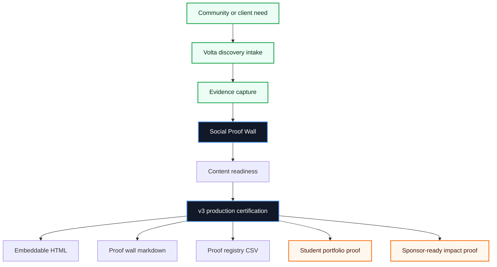
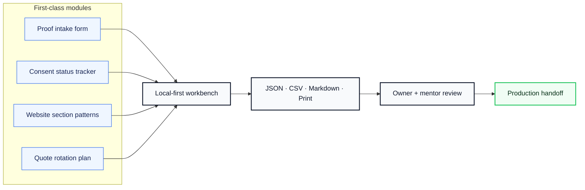
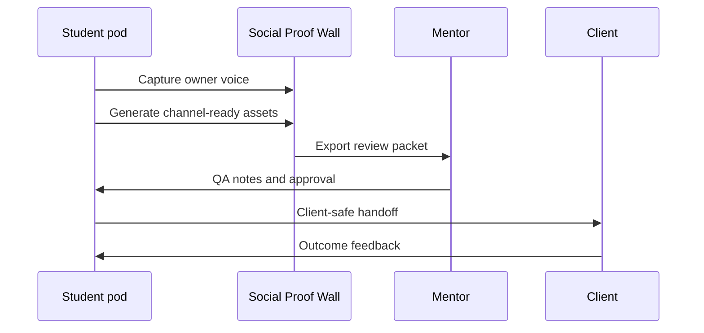

<div align="center">

# 📣 Social Proof Wall

### Collect testimonials, review quotes, press snippets, and before-after proof into reusable web sections.


**Marketing & Content** · **No backend. No login. Client data stays local.**

[Live app](https://volta-npo.github.io/social-proof-wall/) · [Report an issue](https://github.com/volta-npo/social-proof-wall/issues) · [Volta](https://voltanpo.org)

</div>

---

## ✨ What it does

**Social Proof Wall** is a polished, local-first open-source tool from Volta's 50-project OSS division. It helps Web and marketing students building trust for clients turn real community work into structured evidence, client-safe handoffs, and mentor-reviewable release packets.

> **Volta principle:** digital equity is economic equity. Every tool in this collection is designed so students can ship useful, accountable technology for small businesses, nonprofits, and community organizations that are usually priced out of high-quality digital transformation.

### The gap it closes

Small businesses have scattered proof across Google, texts, Instagram, and word of mouth.

### The niche

Trust-building for under-known local businesses.

### North-star metric

`approved proof assets published`

---

## 🧭 Product map







---

## 🟦 TypeScript-first

This repository is authored in **TypeScript**. The checked-in JavaScript files are compiled artifacts so the project can run directly on GitHub Pages without a build server.

- Source: `src/**/*.ts` and `test/**/*.ts`
- Build: `npm run build`
- Runtime artifacts: `src/**/*.js` for static hosting

---

## 🚀 Features

| Area | What ships in v3 |
|---|---|
| **Domain workbench** | A purpose-built proof wall interface for collect testimonials, review quotes, press snippets, and before-after proof into reusable web sections. |
| **Local-first runtime** | Runs as a static web app with local autosave and no server dependency. |
| **Certification flow** | Release gates require status, owner, severity, and evidence before production handoff. |
| **Exports** | JSON production bundle, CSV operational table, Markdown certification report, print-ready handoff. |
| **Integrity** | Deterministic certification hash detects changed evidence. |
| **Safety** | Privacy notes, secret-safe markdown checks, wrong-product import rejection, client-safe defaults. |
| **Accessibility** | Skip links, keyboard-friendly controls, ARIA meter/list semantics, high-contrast focus support. |

---

## 🧩 Modules

| # | Module | Why it matters |
|---:|---|---|
| 1 | **Proof intake form** | Converts field work into repeatable, reviewable Volta delivery evidence. |
| 2 | **Consent status tracker** | Converts field work into repeatable, reviewable Volta delivery evidence. |
| 3 | **Website section patterns** | Converts field work into repeatable, reviewable Volta delivery evidence. |
| 4 | **Quote rotation plan** | Converts field work into repeatable, reviewable Volta delivery evidence. |

---

## ✅ Production acceptance

| Gate | Acceptance signal |
|---:|---|
| 1 | owner approval required |
| 2 | consent tracked |
| 3 | channel-ready copy exported |
| 4 | local voice preserved |

<details>
<summary><strong>Full v3 quality gates</strong></summary>

- All exports work offline
- Privacy and data handling documented
- No blocked critical gates
- Every certified claim has evidence
- Import rejects wrong product bundles
- Release hash is deterministic
- Client-safe markdown contains no secrets
- CSV contains every operational row
- Source and permission required
- No edited meaning
- Unverified proof blocked from export

</details>

---

## 🛠️ Quick start

```bash
git clone https://github.com/volta-npo/social-proof-wall.git
cd 30-social-proof-wall
npm install
npm test
npm start
```

Then open the local URL shown by Python, usually:

```text
http://localhost:4173
```

No install step is required for the app itself. Tests use Node's built-in test runner.

---

## 🧪 Validation

This repository includes **25 automated tests** covering core scoring, domain behavior, v1 release behavior, and v3 production certification.

```bash
npm test
```

Test coverage includes:

- configuration weights and launch readiness
- product-specific domain sample data
- artifact generation and markdown exports
- v1 launch packet behavior
- v3 import/export round trips
- wrong-product import rejection
- deterministic integrity hashes
- blocked/critical gate prevention
- markdown safety checks

---

## 📦 Repository layout

```text
.
├── index.html              # Static app shell
├── styles.css              # Responsive Volta UI system
├── src/
│   ├── config.js           # Product mission, rubric, and sample data
│   ├── domain.js           # Domain-specific workbench definition
│   ├── domain-core.js      # Domain calculations and artifacts
│   ├── v1*.js              # v1 release layer
│   └── v3*.js              # v3 production certification layer
├── test/                   # 25 automated tests
├── docs/                   # Operations, QA, release checklist
└── examples/               # Production bundle template
```

---

## 🌍 Why Volta is open-sourcing this

Volta works with students, nonprofits, and small businesses to make practical digital transformation accessible. These repositories are intentionally:

- **small enough to understand** in a student pod
- **useful enough to run** in a real community engagement
- **safe enough to hand off** to a nontechnical owner
- **structured enough to review** by mentors and sponsors
- **open enough to fork** for any chapter or community group

---

## 🤝 Contributing

Contributions are welcome if they improve real-world usefulness for under-resourced organizations. The best issues include:

1. a real user or chapter scenario,
2. before/after evidence,
3. privacy and accessibility considerations,
4. a test or release-checklist update.

Read [CONTRIBUTING.md](./CONTRIBUTING.md), [SECURITY.md](./SECURITY.md), and [CODE_OF_CONDUCT.md](./CODE_OF_CONDUCT.md) before opening a PR.

---

## 📄 License

MIT License. Built by the Volta OSS Division for public benefit.

<div align="center">

**Designed in Jacksonville. Coded globally. Built for digital equity.**

</div>
